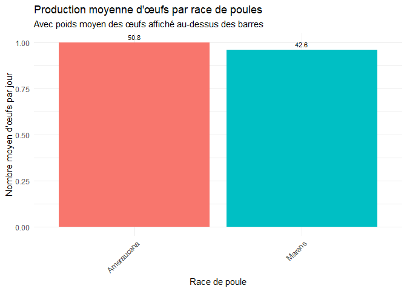

Proposition de projet
================
Noms des membres de l’équipe

``` r
library(broom)
```

## Section 1 Introduction

**Question de recherche** : Quels sont les principaux facteurs
influençant la production d’œufs et les caractéristiques physiques des
poules domestiques, et comment varient-ils en fonction des races, des
conditions d’élevage et des pratiques alimentaires ?

**Jeu de données** : Le dataset provient d’un regroupement de données
sur les poules domestiques et leurs caractéristiques biologiques et
environnementales. Il comprend des informations détaillées sur des
facteurs comme la race, l’alimentation, l’exposition au soleil, et
d’autres caractéristiques physiques. Les données ont été collectées et
structurées pour permettre une analyse des éléments influençant la
production d’œufs et les caractéristiques physiques des poules.

**Sujet et variables** : Le dataset couvre un échantillon de **190
poules**, avec des informations collectées sur une période d’environ **5
jours** pour chaque individu. Les variables incluent le poids des
poules, la race, la couleur des œufs, la quantité de nourriture donnée,
l’exposition au soleil, et le nombre d’œufs pondus par jour. Ces données
comprennent des variables catégorielles, des mesures continues et des
variables discrètes, permettant une exploration des interactions entre
les conditions d’élevage, les caractéristiques biologiques et la
production d’œufs sur plusieurs jours.

## Section 2 Donnees

Les données sont fournies au format CSV et sont stockées dans le
répertoire /data du dépôt GitHub du projet. Le jeu de données comporte
**1 000** observations et **16 variables.**

voici un apercu:

    ## Rows: 1,000
    ## Columns: 16
    ## $ GallusID             <chr> "Marans1", "Marans1", "Marans1", "Marans1", "Mara…
    ## $ GallusBreed          <chr> "Marans", "Marans", "Marans", "Marans", "Marans",…
    ## $ Day                  <int> 1, 2, 3, 4, 5, 1, 2, 3, 4, 5, 1, 2, 3, 4, 5, 1, 2…
    ## $ Age                  <int> 883, 883, 883, 883, 883, 684, 684, 684, 684, 684,…
    ## $ GallusWeight         <int> 3000, 3000, 3000, 3000, 3000, 1750, 1750, 1750, 1…
    ## $ GallusEggColor       <chr> "Brown", "Brown", "Brown", "Brown", "Brown", "Bro…
    ## $ GallusEggWeight      <dbl> 41.19, 41.19, 41.19, 41.19, 41.19, 52.91, 52.91, …
    ## $ AmountOfFeed         <int> 114, 114, 114, 114, 114, 111, 111, 111, 111, 111,…
    ## $ EggsPerDay           <int> 1, 1, 1, 1, 1, 1, 1, 1, 1, 1, 1, 1, 1, 1, 1, 1, 1…
    ## $ GallusCombType       <chr> "Single", "Single", "Single", "Single", "Single",…
    ## $ SunLightExposure     <int> 7, 7, 7, 7, 7, 9, 9, 9, 9, 9, 7, 7, 7, 7, 7, 8, 8…
    ## $ GallusClass          <chr> "Continental", "Continental", "Continental", "Con…
    ## $ GallusLegShanksColor <chr> "White", "White", "White", "White", "White", "Whi…
    ## $ GallusBeakColor      <chr> "White", "White", "White", "White", "White", "Whi…
    ## $ GallusEarLobesColor  <chr> "NULL", "NULL", "NULL", "NULL", "NULL", "NULL", "…
    ## $ GallusPlumage        <chr> "Blue Copper", "Blue Copper", "Blue Copper", "Blu…

# Section 3 -Plan d’analyse des données

**1. Variables de résultat (Y) et explicatives (X)** **Variable de
résultat (Y) :** Production d’œufs par jour (EggsPerDay).

**Variables explicatives (X)** : Poids des poules
(GallusWeight),Quantité de nourriture (AmountOfFeed),Exposition au
soleil (SunLightExposure),Race de poule (GallusBreed),Poids des œufs
(GallusEggWeight).

**Groupes de comparaison** : Race de poule, Nourriture, Exposition au
soleil

**2. Analyse exploratoire préliminaire**

<!-- --> Ce
graphique montre la production moyenne d’œufs par race, avec le poids
moyen des œufs affiché au-dessus des barres.

**3.Méthodes statistiques envisagées**

**Régression linéaire multiple** : Modéliser l’effet de plusieurs
variables sur la production d’œufs.

**ANOVA** : Comparer les races pour des différences significatives dans
la production.

**Corrélations** : Explorer la relation entre la quantité de nourriture,
le poids et la production d’œufs.

**4. Résultats attendus**

**Régression linéaire multiple** : Coefficients pour évaluer l’impact de
chaque variable explicative.

**ANOVA** : P-value pour identifier les différences significatives entre
les races.

**Corrélations** : Identification des associations fortes entre les
variables continues.
